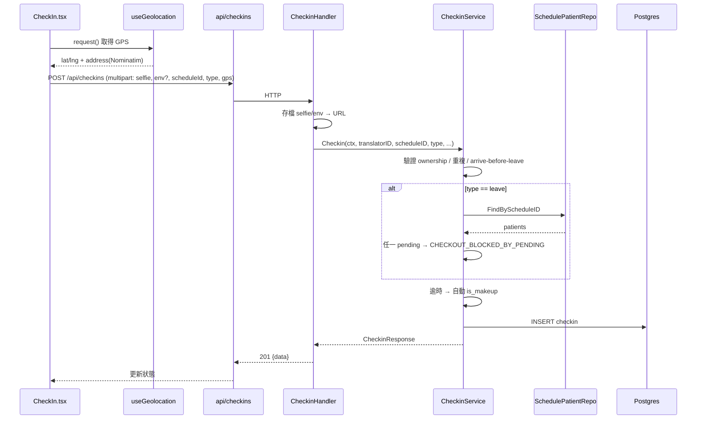

# 翻譯員打卡系統 — 技術架構規格書（Architecture Spec）

> 本文件是技術規格書的**頂層入口**。它描述整體架構、分層、跨切面關注（auth、tracing、error、i18n），並連結到每個模組的子規格書。
> 產品面請見 [PRODUCT_SPEC.md](PRODUCT_SPEC.md)。規格範本見 `SPEC_TEMPLATE.md`（顆粒度：每套件一份，複雜的單一元件另開重型 spec）。

---

## 1. 系統總覽

```
┌────────────┐   HTTPS    ┌─────────────────────┐   GORM    ┌────────────┐
│  Frontend  │ ─────────▶ │      Backend         │ ────────▶ │ PostgreSQL │
│ React+Vite │ ◀───────── │  Go + Gin            │ ◀──────── │            │
│ Ant Design │   /api     │                      │           └────────────┘
└────────────┘            │  ┌────────────────┐  │
       │ /uploads (static)│  │ OTel SDK       │  │  OTLP/gRPC   ┌────────┐
       └──────────────────│  └────────────────┘  │ ───────────▶ │ Jaeger │
                          └──────────┬───────────┘              └────────┘
                                     │ 外部服務
                       ┌─────────────┼───────────────┬───────────────┐
                       ▼             ▼               ▼               ▼
                  Nominatim     LINE Push API    Google Sheets     SMTP
                 (reverse geo)   (notify)        (export)         (mail)
```

技術棧：
- **Backend**：Go + Gin + GORM + PostgreSQL，分層 handler → service → repository → model。
- **Frontend**：React + TypeScript + Vite + Ant Design v5 + react-router + i18next。
- **Infra**：Docker Compose（postgres、jaeger、backend、frontend）。
- **可觀測性**：OpenTelemetry SDK → OTLP/gRPC → Jaeger（gin server span、GORM SQL span、outbound HTTP span）。

詳細部署 / 對外穿透見 [docs/local-expose.md](docs/local-expose.md)。

---

## 2. 後端分層與依賴方向

```
HTTP Request
   │
   ▼
[middleware]  JWTAuth → RequirePasswordChanged → RoleRequired   → backend/internal/middleware/MIDDLEWARE_SPEC.md
   │
   ▼
[handler]     bind DTO、取 userID、存檔、呼叫 service、map error → backend/internal/handler/HANDLER_SPEC.md
   │
   ▼
[service]     商業邏輯、驗證、sentinel error、context 傳遞       → backend/internal/service/SERVICE_SPEC.md
   │
   ▼
[repository]  GORM 查詢、WithCtx(ctx) 注入 tracing context       → backend/internal/repository/REPOSITORY_SPEC.md
   │
   ▼
[model]       GORM struct / 資料表                               → backend/internal/model/MODEL_SPEC.md
```

橫切：
- **DTO**（request/response + error code 常數）→ [backend/internal/dto/DTO_SPEC.md](backend/internal/dto/DTO_SPEC.md)
- **Config**（env 載入、JWT secret 強制）→ [backend/internal/config/CONFIG_SPEC.md](backend/internal/config/CONFIG_SPEC.md)
- **Tracing** → [backend/internal/tracing/TRACING_SPEC.md](backend/internal/tracing/TRACING_SPEC.md)
- **Bootstrap / wiring / cron** → [backend/cmd/server/SERVER_SPEC.md](backend/cmd/server/SERVER_SPEC.md)

### 2.1 不變式（架構級）
| 不變式 | 保證方式 |
|--------|----------|
| 每個 repository 有 `WithCtx(ctx)`，每個 handler 傳 `c.Request.Context()` | 人工維持（CLAUDE.md 規約）。破壞 → SQL span 不會 nest 在 request span 下 |
| service 不直接碰 `*gin.Context`；只收原生型別 + `context.Context` | 人工維持 |
| 錯誤一律以 sentinel error 回到 handler，由 `mapError` 統一轉 code | 人工維持；新 sentinel 必須同步加進 error_mapper + dto code |
| JWT secret 非預設且 ≥32 字 | 機制保證（config.Load 不符就 `os.Exit(1)`）|

---

## 3. 服務層模組地圖（service layer）

| 模組 | 職責 | 規格 |
|------|------|------|
| AuthService | 登入 / lockout / 改密碼 / 重設 | [重型 ★](backend/internal/service/AUTH_SERVICE_SPEC.md) |
| CheckinService | 打卡 / 補打卡 / 離開守衛 / 統計 | [重型 ★](backend/internal/service/CHECKIN_SERVICE_SPEC.md) |
| ScheduleService | 排班 CRUD / 多病人 / 週期展開 / 匯入 | [重型 ★](backend/internal/service/SCHEDULE_SERVICE_SPEC.md) |
| DiagnosisService | 逐病人診斷照片 / no_show / 結果總覽 | [重型 ★](backend/internal/service/DIAGNOSIS_SERVICE_SPEC.md) |
| PatientService | 病人 CRUD / scope / 就診歷史 | [service overview](backend/internal/service/SERVICE_SPEC.md) |
| TranslatorService / AdminService | 帳號管理 | 同上 |
| ExportService | Excel / Google Sheet / 定期匯出 | 同上 |
| NotificationService | LINE / Email 排程提醒 | 同上 |
| GeocodingService | Nominatim 反查地址 | 同上 |
| MailService | SMTP 寄信（含附件）| 同上 |
| CleanupService | 舊照片清除 cron | 同上 |
| AuditService | 稽核寫入 / 查詢 | 同上 |

---

## 4. 前端架構

```
main.tsx → App.tsx (ConfigProvider + AntApp + AuthProvider + Routes)
   │
   ├─ RequireAuth / RequireAdmin / RequireTranslator  (route guards)
   ├─ stores/authStore  (Context: user/token/login/logout)   → frontend/src/stores/AUTH_STORE_SPEC.md
   ├─ api/client + api/*  (axios，unwrap envelope、error→i18n、401/403 導向) → frontend/src/api/API_CLIENT_SPEC.md
   ├─ pages/(admin|translator)/*  (Ant Design 頁面)            → frontend/src/pages/PAGES_SPEC.md
   ├─ components/*  (PatientPicker、SchedulePatientListEditor、DiagnosisUploadModal、NoShowModal、MapLink…) → frontend/src/components/COMPONENTS_SPEC.md
   ├─ hooks/useGeolocation  (定位狀態機)                       → frontend/src/hooks/HOOKS_SPEC.md
   └─ i18n/*  (en/zh-TW/th)                                    → frontend/src/i18n/I18N_SPEC.md
```

前端總覽見 [frontend/src/FRONTEND_SPEC.md](frontend/src/FRONTEND_SPEC.md)。

---

## 5. 跨層資料流範例（打卡）



---

## 6. 錯誤處理與 i18n 契約

1. service 回 sentinel error（如 `ErrDuplicateCheckin`）。
2. handler 呼叫 `respondError(c, err)` → `mapError` 對照 `(httpStatus, code)`。
3. 回傳 `{ code, message }`（`dto.NewError`）。
4. 前端 `mapErrorResponse` 用 `i18n.t("errors.<code>")` 翻譯；401 非登入頁 → 清 token 導 `/login`；403 `PASSWORD_CHANGE_REQUIRED` → 導 `/change-password`。

新增一條 error 的 checklist：
- [ ] service 定義 sentinel `Err...`
- [ ] dto 定義 `Code...` 常數
- [ ] error_mapper 加 case
- [ ] 前端三語 locale 加 `errors.<CODE>`

---

## 7. 測試策略

| 層 | 工具 | 重點 |
|----|------|------|
| 後端 service / handler / mapper | Go `testing` + `testify`，DB 用 in-memory SQLite | 商業邏輯、error mapping、權限、正規化 |
| 前端 | vitest + @testing-library/react | 元件互動、store、apiError、i18n |
| E2E | Playwright（`e2e/`）| 全流程（auth、排班、打卡、補打卡、診斷、匯出、i18n、responsive）|

E2E 專用 reset 端點僅在 `-tags e2e` 且 `ENABLE_TEST_RESET=true` 時註冊（見 [SERVER_SPEC](backend/cmd/server/SERVER_SPEC.md)）。
測試計畫見 [TEST-PLAN.md](TEST-PLAN.md) / [TEST-CASES.md](TEST-CASES.md)。

---

## 8. 子規格書索引

**Backend**
- [cmd/server — bootstrap / 路由 / cron](backend/cmd/server/SERVER_SPEC.md)
- [config](backend/internal/config/CONFIG_SPEC.md)
- [middleware](backend/internal/middleware/MIDDLEWARE_SPEC.md)
- [model](backend/internal/model/MODEL_SPEC.md)
- [dto](backend/internal/dto/DTO_SPEC.md)
- [repository](backend/internal/repository/REPOSITORY_SPEC.md)
- [service（overview）](backend/internal/service/SERVICE_SPEC.md)
  - [AuthService ★](backend/internal/service/AUTH_SERVICE_SPEC.md)
  - [CheckinService ★](backend/internal/service/CHECKIN_SERVICE_SPEC.md)
  - [ScheduleService ★](backend/internal/service/SCHEDULE_SERVICE_SPEC.md)
  - [DiagnosisService ★](backend/internal/service/DIAGNOSIS_SERVICE_SPEC.md)
- [handler](backend/internal/handler/HANDLER_SPEC.md)
- [tracing](backend/internal/tracing/TRACING_SPEC.md)

**Frontend**
- [frontend overview](frontend/src/FRONTEND_SPEC.md)
- [api client](frontend/src/api/API_CLIENT_SPEC.md)
- [stores/authStore](frontend/src/stores/AUTH_STORE_SPEC.md)
- [pages](frontend/src/pages/PAGES_SPEC.md)
- [components](frontend/src/components/COMPONENTS_SPEC.md)
- [hooks/useGeolocation ★](frontend/src/hooks/HOOKS_SPEC.md)
- [i18n](frontend/src/i18n/I18N_SPEC.md)

**Infra / 測試 / 部署**
- [docker（compose stacks / Dockerfile / nginx）](docker/DOCKER_SPEC.md)
- [e2e（Playwright）](e2e/E2E_SPEC.md)
- [測試策略與使用說明](TESTING_SPEC.md)
- [部署規格與使用說明](DEPLOYMENT_SPEC.md)
