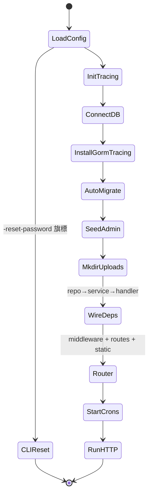

# cmd/server — 規格（重型 ★：bootstrap / wiring / cron）

> 對應檔案：`backend/cmd/server/main.go`
> 上層：[ARCHITECTURE_SPEC.md](../../../ARCHITECTURE_SPEC.md)

## 1. 定位與職責
程序進入點：載設定 → 初始化 tracing → 連 DB → migrate → seed admin → **組裝整個依賴圖（repo→service→handler）** → 註冊路由與 middleware → 啟動 cron → 起 HTTP server。也是 PII 清洗與 CLI 工具的所在。

## 2. 啟動序列

## 3. 依賴組裝（wiring）
- 8 repos → 13 services（選用相依用 builder：`scheduleService.WithPatientRepos(...)`、`checkinService.WithSchedulePatientRepo(...)`、`patientService.WithScopeRepo(...).WithHistoryRepos(...)`）→ 9 handlers。
- 完整圖見 main.go L110–148；對應各 [service spec](../../internal/service/SERVICE_SPEC.md)。

## 4. 路由與 middleware（節錄，全表見 main.go L184–273）
- 全域：`otelgin`（span 名用 route template 降基數）→ `scrubSensitiveSpanAttributes`（移除 query string PII）→ CORS（dev 全開）→ `/uploads` 靜態。
- `/api/auth/*` public（login）/ JWTAuth（change-password）。
- `/api/admin/*`：JWTAuth → RequirePasswordChanged → RoleRequired("admin")。
  - 病人 xlsx：`POST /admin/patients/import`（匯入；放 POST 樹避開 `/patients/:id` wildcard）、`GET /admin/export/patients`、`GET /admin/export/patients-template`（匯出/範本放 `/export/*` 避開 GET `:id` wildcard）。
  - 金額統計：`GET /admin/patients/:id/history?dateFrom&dateTo`（區間就診歷史 + 實付總額）、`GET /admin/patients/:id/actual-total?year`（年度實付）、`GET /admin/stats/monthly-total`（後台橫幅當月病人總實付）。`:id/history` 與 `:id/actual-total` 為同一 `:id` 節點下相異靜態子路徑，無 wildcard 衝突。
- translator 群組（`/schedules`、`/checkins*`、`/patients`）：…RoleRequired("translator")。
  - 診斷照片管理：`GET /checkins/diagnosis/photos?schedulePatientId=`（列出含 id）、`DELETE /checkins/diagnosis/photos/:photoId`（刪除）。list 刻意用 query param，避免與 `:photoId` 造成 gin wildcard 衝突；admin 端對應 `GET/DELETE /admin/diagnosis/photos[...]`。
  - 金額：`POST /checkins/diagnosis/amount`（翻譯員設實付）、`POST /admin/diagnosis/amount`（admin）、`GET /admin/export/diagnosis`（診斷結果 xlsx）。
- 守衛細節見 [middleware spec](../../internal/middleware/MIDDLEWARE_SPEC.md)。

## 5. Cron 排程（3 個）
| 時間 | 工作 | 來源 service |
|------|------|--------------|
| `0 8 * * *` | 定期匯出：當天符合 day_of_month 的設定 → 上月報表 email | ExportService.RunExportForAdmin |
| `0 7 * * *` | 明日排程提醒（LINE+Email）| NotificationService.SendScheduleReminders |
| `0 3 * * *` | 清除逾期照片（**預設 no-op**：`PHOTO_RETENTION_DAYS=0` 表永久保存；只有設正整數才會清）| CleanupService.RunPhotoCleanup |

每個 cron tick 開**獨立 root span**（`cron.*`），讓 Jaeger 每次執行成一條 trace。

## 6. 不變式
| 不變式 | 保證 |
|--------|------|
| seed admin 只在不存在時建立 | 機制保證（先 count email=admin@admin.com）|
| admin 預設密碼 must_change_pw=true | 機制保證 |
| 缺 ADMIN_DEFAULT_PASSWORD → 隨機產生並 log 一次 | 機制保證 |
| migrate 失敗 → 不啟動 | 機制保證（`log.Fatalf`）|
| PII（query string / bound vars）不進 span | 機制保證（gorm `WithoutQueryVariables` + scrub middleware）|

## 7. PII 清洗
- gorm plugin：`WithoutQueryVariables`（綁定參數不入 span）、`WithoutMetrics`。
- `scrubSensitiveSpanAttributes`：請求後把 `http.target` 改寫成「不含 query string 的 path」。

## 8. CLI / 特殊建置
- `server -reset-password <email> <newPW>`：連 DB 直接重設（救援用），新密碼須 ≥8 字，重設後 must_change_pw=true。
- `RegisterTestResetRoutes`：**僅 `-tags e2e` 且 `ENABLE_TEST_RESET=true`** 時註冊 reset 端點；其他建置為 no-op stub（`test_reset_stub.go`）。

## 9. 邊界條件
| 情境 | 行為 |
|------|------|
| tracing collector 不可達 | 仍啟動（只 log warning）|
| JWT_SECRET 不安全 | config.Load 直接 `os.Exit(1)`（在本檔之前）|
| upload dir 建不出 | `log.Fatalf` 不啟動 |

## 10. 已知技術債 / 重構方向
- wiring 全寫在 main，依賴一多會臃腫；可考慮 provider/DI 群組。
- cron 時間寫死台北時區語意（依賴容器 TZ）。
- CORS dev 全開，上線需收斂。
