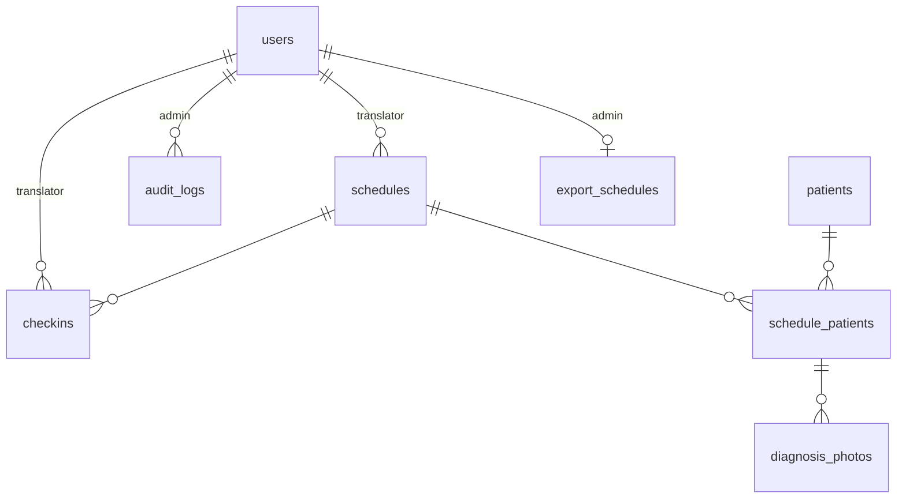

# model — 規格（輕量）

> 對應檔案：`backend/internal/model/*.go`
> 上層：[ARCHITECTURE_SPEC.md](../../../ARCHITECTURE_SPEC.md)

## 1. 定位與職責
GORM struct 對應 PostgreSQL 資料表，是系統的持久化 schema。**只放欄位、關聯、TableName、status 常數**；不放商業邏輯（在 service）、不放查詢（在 repository）。

所有 model 由 `cmd/server/main.go` 的 `AutoMigrate` 建表。

## 2. 資料表與關聯

## 3. 各 model 重點

### user.go — `users`
| 欄位 | 型別 | 備註 |
|------|------|------|
| email | varchar(255) unique | 登入帳號 |
| password_hash | varchar(255) | bcrypt；json `-` 不外露 |
| role | varchar(20) | `admin` / `translator` |
| status | varchar(20) | `active` / `disabled`（預設 active）|
| must_change_pw | bool | 預設 true；首登強制改密碼 |
| login_attempts / locked_until | int / *time | 帳號鎖定狀態（json `-`）|
| line_user_id / telegram_chat_id | varchar | LINE 已用；Telegram 僅欄位未用 |

### patient.go — `patients`
- **唯一鍵**：`(id_type, id_number)`（複合 unique index `idx_patient_id_type_number`）。
- `id_type`：`passport` / `hn` / `unid`。
- `id_number` **由 service 轉大寫 + trim 後存入**（model 本身不處理）。

### schedule.go — `schedules`
- 整體時段 `start_time` / `end_time` 存 `varchar(5)`（"HH:MM" 字串，非 time 型別）。
- `date`（`type:date`）建 **index**（`translator_id` 亦 index）：金額統計與病人歷史皆以 `schedules.date` join 過濾。
- `patient_name *string`：legacy 單病人（stage1/2 相容），新資料用 Patients 關聯。
- `recurrence_rule *string` / `recurrence_group_id *string`：週期排班同組辨識。
- 關聯：`Patients []SchedulePatient`（foreignKey ScheduleID）。

### schedule_patient.go — `schedule_patients`
- **唯一鍵**：`(schedule_id, patient_id)`（`idx_schedule_patient_unique`）→ 同排班不重複病人。
- per-patient `start_time`/`end_time`、`order`、`status`、`no_show_reason`。
- **金額**：`prepaid_amount`（預付，整數元，排班時由 admin 設）、`actual_amount`（實付，整數元，翻譯員事後填；no_show 歸 0）。皆 `not null default 0`。
- **status 常數**（同檔定義，全系統共用）：
  - `SchedulePatientStatusPending = "pending"`
  - `SchedulePatientStatusCompleted = "completed"`
  - `SchedulePatientStatusNoShow = "no_show"`

### checkin.go — `checkins`
- `type`：`arrive` / `leave`。
- `selfie_url` not null（必填）；`environment_url` **nullable**（stage4 後選填）。
- `is_makeup` / `makeup_reason`：補打卡或逾時自動標記。
- 關聯：Schedule、Translator（json omitempty）。

### diagnosis_photo.go — `diagnosis_photos`
- 綁 `schedule_patient_id`；每組最多 30 張（上限由 DiagnosisService 守，model 不擋）。
- 注意：此表 json tag 用 camelCase（`schedulePatientId`/`photoUrl`），與多數 snake_case model 不同。

### export_schedule.go — `export_schedules`
- `admin_id` unique（一個 admin 一筆設定）；`frequency`（monthly）、`day_of_month`(1-28)、`format`(excel/google_sheet)、`email_to`、`enabled`、`last_run_at`。

### audit_log.go — `audit_logs`
- admin_id(index)、admin_name、action、target_type、target_id、detail、created_at(index)。

## 4. 不變式
| 不變式 | 保證 |
|--------|------|
| `(id_type,id_number)` 唯一、`(schedule_id,patient_id)` 唯一 | **機制保證**（DB unique index）|
| id_number 大寫正規化 | **人工維持**（在 PatientService，繞過 service 直接寫 DB 會破壞）|
| start/end_time 為 "HH:MM" 字串、可字串比較大小 | **人工維持**（service 的時段比較依賴此格式）|
| status 只取三個 pending/completed/no_show 常數 | **人工維持**（用常數而非字面值）|

## 5. 已知技術債
- time 用字串存取（非原生 time/interval），跨午夜或時區換算需小心；目前所有時段都同日。
- `schedules.patient_name` 與 SchedulePatient 兩套病人表述並存，需逐步淘汰 legacy 欄位。
- diagnosis_photo 的 json 命名風格與其他 model 不一致。

## 6. 協作者
被 [repository](../repository/REPOSITORY_SPEC.md) 查詢、[service](../service/SERVICE_SPEC.md) 操作；schema 由 [cmd/server](../../cmd/server/SERVER_SPEC.md) migrate。
