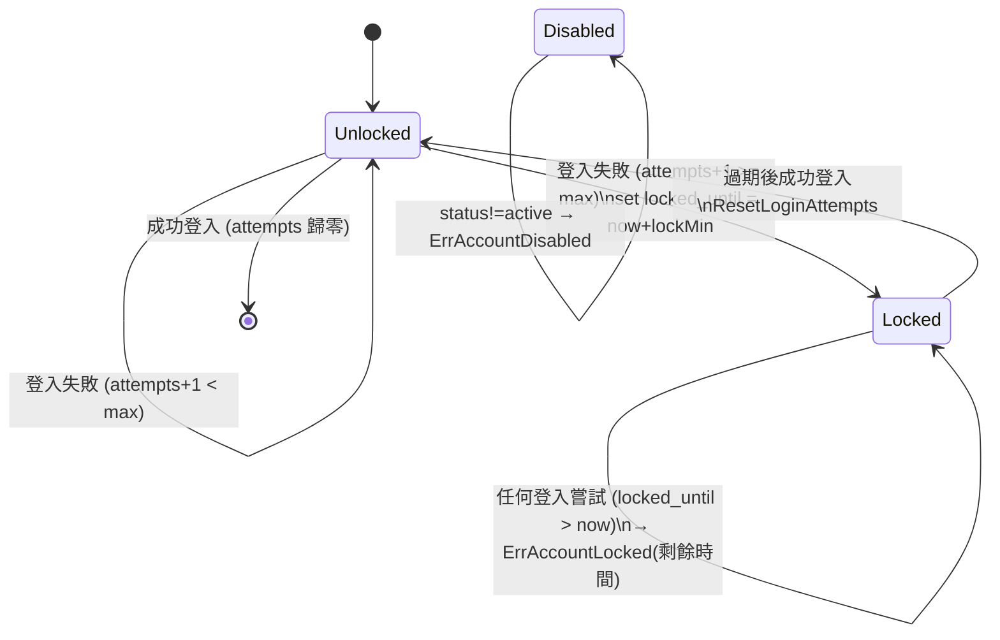
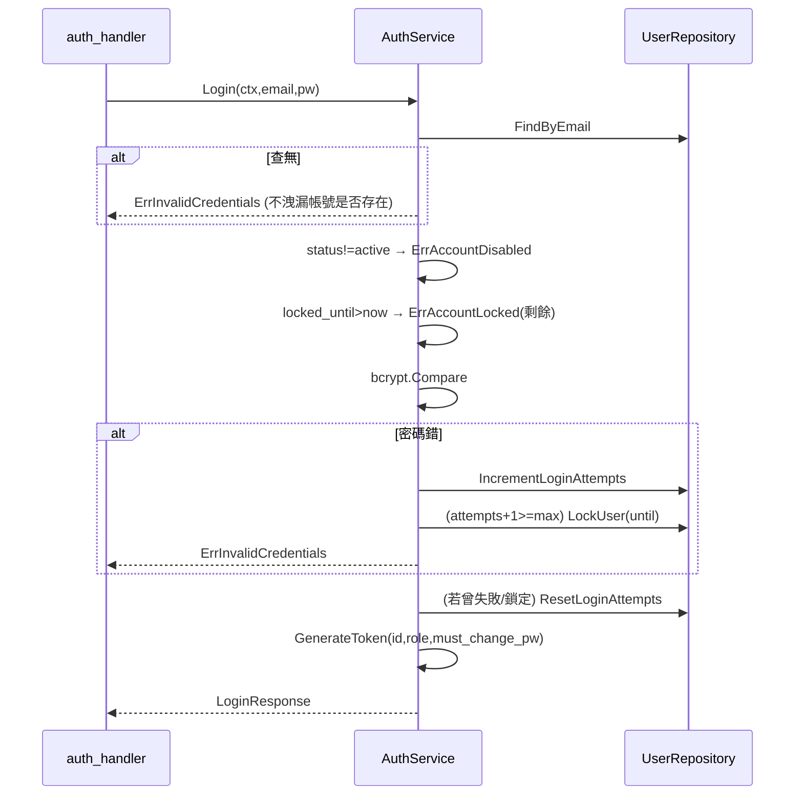

# AuthService — 規格（重型 ★）

> 對應檔案：`backend/internal/service/auth_service.go`
> 上層：[service overview](SERVICE_SPEC.md) ← [ARCHITECTURE_SPEC.md](../../../ARCHITECTURE_SPEC.md)

## 1. 定位與職責
認證的商業邏輯：登入驗證、**帳號鎖定（lockout）**、改密碼、管理員重設密碼。
- **做**：bcrypt 比對、lockout 狀態機、JWT 簽發（委由 `middleware.GenerateToken`）。
- **不做**：JWT 解析（middleware）、HTTP 處理（handler）、密碼複雜度規則（目前僅 handler/前端最小驗證）。
- 在哪層：service。非 singleton（由 main 建一個實例注入）。

## 2. 對外契約

| 方法 | 參數 | 回傳 | 前置 / 備註 |
|------|------|------|------------|
| `Login` | ctx, email, password | `*dto.LoginResponse`(token+user) / err | 帳號須 active、未鎖定、密碼正確 |
| `ChangePassword` | ctx, userID, oldPW, newPW | newToken / err | 驗舊密碼；成功後 must_change_pw→false 並**重簽 JWT** |
| `AdminResetPassword` | ctx, adminID, targetID, newPW | err | `adminID==targetID` → `ErrCannotResetSelf`；目標被 force change |

Sentinel errors：`ErrInvalidCredentials / ErrAccountDisabled / ErrAccountLocked / ErrUserNotFound / ErrOldPasswordIncorrect / ErrPasswordHashFailed / ErrTokenGenFailed / ErrCannotResetSelf`。

## 3. 狀態模型（帳號鎖定）

### 3a. 相關欄位（users 表）
- `login_attempts int`：連續失敗次數。
- `locked_until *time.Time`：鎖定到期時間（nil = 未鎖）。
- `status`：active/disabled（disabled 直接擋登入，與 lockout 獨立）。

### 3b. 狀態機（單一帳號的登入狀態）

參數來源：`config.AppConfig.MaxLoginAttempts`（預設5）、`LockDurationMinutes`（預設15）。

### 3c. 不變式
| 不變式 | 保證 |
|--------|------|
| 成功登入後 attempts/lock 清零 | 人工維持（Login 末段 `ResetLoginAttempts`）|
| 鎖定期間即使密碼正確也不放行 | 機制保證（lockout 檢查在 bcrypt 比對**之前**）|
| disabled 帳號永遠擋下 | 機制保證（status 檢查在最前）|
| must_change_pw 帳號改密碼後 token 不再帶該 flag | 機制保證（ChangePassword 重簽 token claim=false）|

## 4. 主要流程（Login）

## 5. 邊界條件表
| 情境 | 事件 | 行為 |
|------|------|------|
| email 不存在 | Login | `ErrInvalidCredentials`（與密碼錯同訊息，防帳號列舉）|
| 帳號 disabled | Login | `ErrAccountDisabled`（即使密碼對）|
| 鎖定未過期 | Login | `ErrAccountLocked` + 剩餘秒數 |
| 第 max 次失敗 | Login | 該次回 InvalidCredentials，同時設 locked_until |
| 鎖定已過期 + 密碼對 | Login | 成功並清零（隱性解鎖）|
| 改密碼舊密碼錯 | ChangePassword | `ErrOldPasswordIncorrect` |
| admin 重設自己 | AdminResetPassword | `ErrCannotResetSelf`（應走 ChangePassword）|

## 6. 副作用與外部互動
- 寫 users：attempts/lock/password_hash/must_change_pw。
- 產 JWT（HS256，secret + 過期時數來自 config）。
- 無外部 HTTP。

## 7. 錯誤處理與並發假設
- 失敗計數 increment + 條件 lock 是**兩段非原子操作**；高並發暴力嘗試理論上可能多算/少算幾次，但對 <100 人內部系統可接受。
- 所有 DB 錯誤被收斂成 InvalidCredentials/sentinel，不外洩細節。

## 8. 測試考量
- `auth_service_test.go`：lockout 門檻、解鎖、disabled、改密碼重簽、reset self。
- 縫：UserRepository 可用 SQLite fake 注入；時間相關（locked_until）用相對時間斷言。

## 9. 已知技術債
- lockout 計數非原子。
- 無密碼強度政策（僅 CLI reset 檢查 ≥8）。
- 無 refresh token / 登出黑名單（JWT 到期前一律有效）。

## 10. 重構方向
- increment+lock 改成單一 SQL `UPDATE ... attempts=attempts+1` + 條件鎖，降低 race。
- 抽出密碼政策驗證成純函式共用於 change/reset/create。
