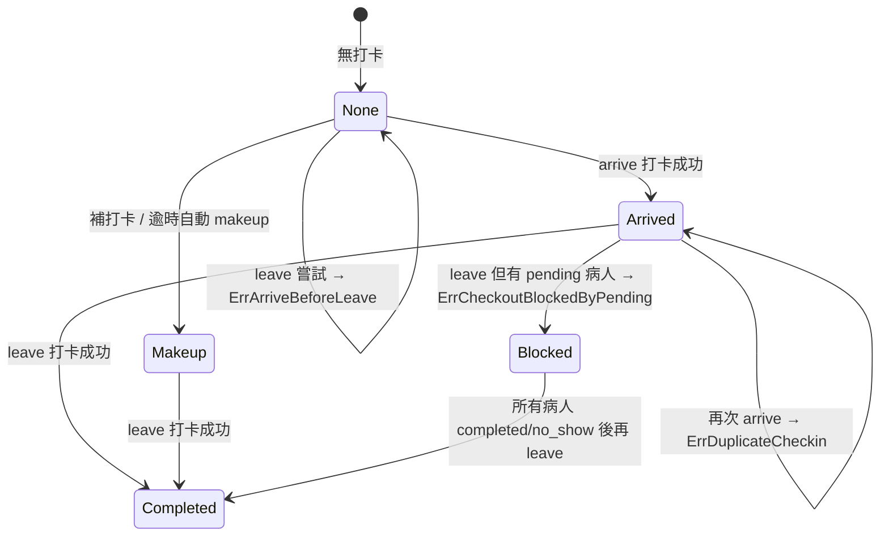
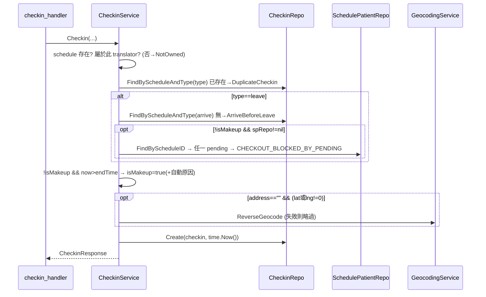

# CheckinService — 規格（重型 ★）

> 對應檔案：`backend/internal/service/checkin_service.go`
> 上層：[service overview](SERVICE_SPEC.md) ← [ARCHITECTURE_SPEC.md](../../../ARCHITECTURE_SPEC.md)

## 1. 定位與職責
打卡（arrive/leave）與補打卡的商業邏輯：ownership、重複防止、arrive-before-leave、**離開前置（pending 病人阻擋）**、**逾時自動 makeup**、reverse geocode 補地址、admin 編修/刪除、翻譯員歷史/統計。
- **不做**：檔案儲存（handler 存好 selfie/env URL 才呼叫）、HTTP、診斷照片（DiagnosisService）。
- 非 singleton。`spRepo` 為**選用**（`WithSchedulePatientRepo` 注入）：未注入時不執行 pending 阻擋（相容舊 3-arg 測試）。

## 2. 對外契約
| 方法 | 重點 |
|------|------|
| `Checkin(ctx, translatorID, scheduleID, type, lat,lng,address, selfieURL,envURL, isMakeup, makeupReason)` | 核心；arrive/leave 與 makeup 共用此入口 |
| `AdminUpdateCheckin(ctx,id,req)` | 只可改 checkin_time/address/makeup_reason；無欄位 → `ErrNoFieldsToUpdate` |
| `AdminDeleteCheckin(ctx,id)` | 刪除 |
| `MyHistory(ctx,translatorID,from,to)` | 自己的打卡列表 |
| `MyStats(ctx,translatorID,from,to)` | total/arrive/leave/makeup/onTime/late |
| `AdminList(ctx,params)` | 篩 date/translator/type/isMakeup |

Sentinel：`ErrScheduleNotOwned / ErrDuplicateCheckin / ErrArriveBeforeLeave / ErrArriveVerifyFailed / ErrCheckinCreate / ErrCheckoutBlockedByPending / ErrCheckinNotFound / ErrNoFieldsToUpdate`（+ ErrScheduleNotFound/ErrTranslatorNotFound 來自他處）。

## 3. 狀態模型（一筆 schedule 的打卡進度）

### 3a. 隱性狀態（由 checkins 列存在性 + is_makeup 推導，見 ScheduleService.getCheckinStatus）
無持久 status 欄位；狀態 = 「有沒有 arrive 列 / leave 列 / 任一 is_makeup」交織。

### 3b. 狀態機

### 3c. 不變式
| 不變式 | 保證 |
|--------|------|
| 同 schedule 同 type 至多一列 | 人工維持（Checkin 進場查 FindByScheduleAndType；DB 無 unique 約束）|
| leave 必有先行 arrive | 人工維持（查 arrive 列）|
| 非補打卡的 leave 須全病人非 pending | 人工維持（且僅 spRepo!=nil 時生效）|
| 打卡時間 = 伺服器時間 | 機制保證（`time.Now()`，不採用 client 值）|

## 4. 主要流程（Checkin）

## 5. 邊界條件表（直接對應程式 if）
| 情境 | 事件 | 行為 |
|------|------|------|
| schedule 不屬於該 translator | Checkin | `ErrScheduleNotOwned` (403) |
| 同 type 已打 | Checkin | `ErrDuplicateCheckin` (409) |
| 無 arrive 就 leave | leave | `ErrArriveBeforeLeave` (400) |
| 有 pending 病人 + 非補打卡 | leave | `CHECKOUT_BLOCKED_BY_PENDING` (400) |
| 有 pending 病人 + **補打卡** | leave(makeup) | **放行**（補打卡豁免，stage3 決議 B）|
| 打卡時間 > 排班 end + 非主動 makeup | Checkin | 自動 `is_makeup=true` + 系統原因 |
| address 空 + 有座標 | Checkin | 嘗試 Nominatim；失敗仍打卡成功 |
| 座標 0,0（未授權）| Checkin | 不反查、不擋（可空地址打卡）|
| 統計 late 判定 | MyStats | arrive 晚於 start+5min → late，否則 onTime |

## 6. 副作用與外部互動
- 寫 checkins。
- 外呼 Nominatim（GeocodingService，可失敗）。
- 讀 schedule_patients（leave 阻擋）、users（補 translator name）。

## 7. 錯誤處理與並發假設
- 重複打卡靠「先查再寫」，**非 DB 約束**：理論上同一 schedule 並發兩次 arrive 可能都過（內部低頻可接受）。
- 逾時判定用 `time.ParseInLocation(..., time.Local)`，依賴伺服器時區（Asia/Taipei）與 "HH:MM" 字串格式。
- geocode 失敗一律吞掉。

## 8. 測試考量
- `checkin_service_test.go`：重複、arrive-before-leave、pending 阻擋、逾時 makeup、admin update 欄位過濾。
- 縫：GeocodingService 可注入 fake base URL；spRepo 可選擇性注入測 pending 分支。

## 9. 已知技術債
- 缺 DB 層 unique（schedule_id,type）→ 並發重複風險。
- 逾時/late 邏輯散落字串時間解析，跨午夜未處理。

## 10. 重構方向
- 對 (schedule_id,type) 加 DB unique index，把重複防止改成機制保證。
- 把「時段字串 → 可比較時間」抽成共用純函式（與 ScheduleService 共用）。
