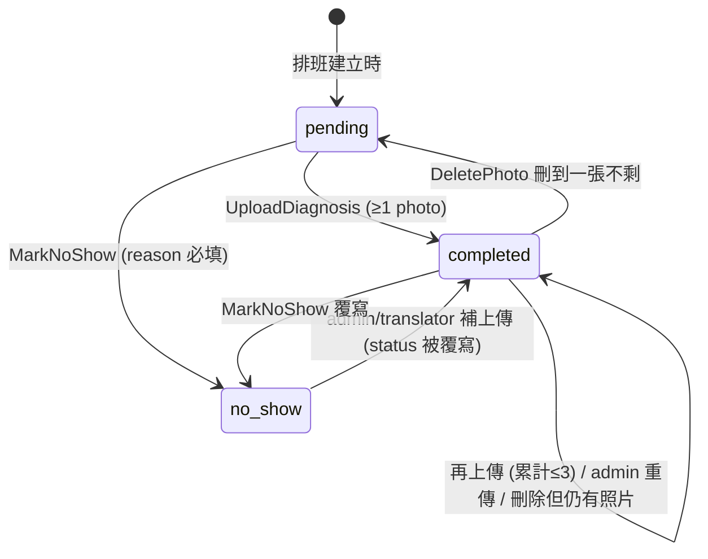
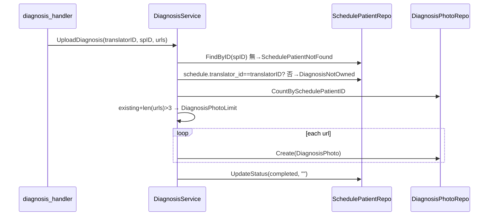

# DiagnosisService — 規格（重型 ★）

> 對應檔案：`backend/internal/service/diagnosis_service.go`
> 上層：[service overview](SERVICE_SPEC.md) ← [ARCHITECTURE_SPEC.md](../../../ARCHITECTURE_SPEC.md)

## 1. 定位與職責
逐 **SchedulePatient** 的服務結果：上傳診斷證明照片（≤3）標記 `completed`、標記 `no_show`（需原因）、查詢照片（含 id，供刪除）、**刪除單張照片（可再補傳）**、**診斷結果總覽（分頁 + 篩選）**。translator 操作需 ownership；admin 有 surrogate 變體（無 ownership 檢查）。
- **不做**：照片存檔（handler 存好 URL 才呼叫）、打卡（CheckinService，但兩者透過 SchedulePatient.status 連動）。
- **做**：刪除照片時 best-effort 移除磁碟檔（`removeUploadedFile`，失敗只記 log 不阻擋）。

## 2. 對外契約
| 方法 | ownership | 說明 |
|------|-----------|------|
| `UploadDiagnosis(ctx,translatorID,spID,urls)` | ✅ | 累計照片≤3，標 completed |
| `MarkNoShow(ctx,translatorID,spID,reason)` | ✅ | reason 必填，標 no_show；**並清空該 slot 既有照片**（按錯更正）|
| `AdminUploadDiagnosis(ctx,spID,urls)` | ✗ | 代理上傳 |
| `AdminMarkNoShow(ctx,spID,reason)` | ✗ | 代理標記 |
| `GetPhotos(ctx,spID)` | ✗ | 回照片 URL（upload time 排序）|
| `ListPhotoItems(ctx,translatorID,spID)` | ✅ | 回照片**含 id**（`DiagnosisPhotoItem`），供管理 modal 刪除 |
| `AdminListPhotoItems(ctx,spID)` | ✗ | 代理版（無 ownership）|
| `DeletePhoto(ctx,translatorID,photoID)` | ✅ | 刪一張照片 + best-effort 刪檔；歸零時 status 退回 pending |
| `AdminDeletePhoto(ctx,photoID)` | ✗ | 代理刪除 |
| `ListResults(ctx,query)` | ✗ | terminal(completed/no_show) 總覽，分頁 |

常數 `MaxDiagnosisPhotos = 3`。Sentinel：`ErrSchedulePatientNotFound / ErrDiagnosisPhotoLimit / ErrDiagnosisNotOwned / ErrDiagnosisPhotoNotFound / ErrDiagnosisLockedAfterLeave / ErrNoShowReasonRequired`。

**離開後鎖定（translator，僅刪除/標未到）**：透過 `WithCheckinRepo` 注入 checkinRepo 後，若該排班已有 `leave` 打卡，translator 的 `DeletePhoto / MarkNoShow` 回 `ErrDiagnosisLockedAfterLeave`（409）。**`UploadDiagnosis` 刻意不鎖**——X 光/檢驗報告常在離開後才出來，允許補傳。唯讀（`ListPhotoItems`）與所有 `Admin*` 變體不受限。未注入 checkinRepo 時鎖定不啟用（legacy/測試）。

## 3. 狀態模型（SchedulePatient.status）

### 3b. 狀態機

> status 轉換**無單向限制**：upload 一律覆寫成 completed、no_show 一律覆寫成 no_show（允許更正）。
> **標記 no_show 會清空既有照片**（視為「按錯 completed，改回 no_show」）→ 保證 no_show slot 不殘留照片。
> **刪除照片**：仍有照片 → 維持 completed；刪到歸零 → 退回 pending（讓該 slot 可重新補傳或標記未到）。因 no_show 不留照片，刪除退回 pending 只會發生在 completed slot。
> **離開後**：排班一旦 leave 打卡，translator 仍可 **upload（補傳晚到報告）**，但不能 delete / no_show（僅 admin 可）。

### 3c. 不變式
| 不變式 | 保證 |
|--------|------|
| 每 SchedulePatient 照片 ≤ 3 | 人工維持（upload 前 `CountBySchedulePatientID + len > 3` 檢查；DB 不擋）|
| translator 只能動自己排班的病人 | 機制保證（assertOwnedSchedulePatient 比對 schedule.translator_id）|
| no_show 必附原因 | 機制保證（reason=="" → 直接回錯）|
| 與離開打卡連動：pending 擋 leave | 在 CheckinService（跨 service 不變式）|

## 4. 主要流程（UploadDiagnosis）

## 5. 邊界條件表
| 情境 | 事件 | 行為 |
|------|------|------|
| spID 不存在 | 任一 | `SCHEDULE_PATIENT_NOT_FOUND` |
| 非自己排班 | translator upload/no_show | `DIAGNOSIS_NOT_OWNED` (403) |
| 既有+新 > 3 | upload | `DIAGNOSIS_PHOTO_LIMIT` (400) |
| no_show 無 reason | no_show | `NO_SHOW_REASON_REQUIRED` (400) |
| photoID 不存在 | delete | `DIAGNOSIS_PHOTO_NOT_FOUND` (404) |
| 刪非自己排班的照片 | translator delete | `DIAGNOSIS_NOT_OWNED` (403) |
| 刪最後一張 | delete | status 退回 `pending` |
| 標記 no_show | no_show | 清空既有照片（避免 no_show slot 殘留照片）|
| 排班已 leave（translator）| **delete / no_show** | `DIAGNOSIS_LOCKED_AFTER_LEAVE` (409)；僅 admin 可刪/改狀態 |
| 排班已 leave（translator）| **upload** | **允許**（補傳晚到的報告）|
| admin 代理 | Admin* | 跳過 ownership 與離開鎖定 |
| ListResults 含 pending | ListResults | **排除**（只回 completed/no_show）|

## 6. ListResults（診斷結果總覽）
- raw join `schedule_patients ⨝ schedules ⨝ users ⨝ patients`，where status in (completed,no_show)。
- 篩選：status / translatorID / dateFrom / dateTo / patientName(LIKE)。
- 排序 `s.date DESC, sp.start_time DESC, sp.id DESC`，分頁（預設 page1/size20）。
- **N+1 防護**：先收集本頁 spIDs，一次撈所有照片再 map 回各列。
- date 跨 DB 相容：sqlite 回 RFC3339、postgres 回 YYYY-MM-DD，統一 trim `T` 之後。

## 7. 並發假設
- 照片上限「先 count 再寫」非原子；同一 SchedulePatient 並發上傳極端情況可能超過 3（低頻內部可接受）。

## 8. 測試考量
- `diagnosis_service_test.go`、`diagnosis_photos_get_test.go`、`diagnosis_results_test.go`。
- 縫：三個 repo 皆可 SQLite fake；ListResults 用 raw SQL，需在 SQLite 與 PG 都驗 date 處理。

## 9. 已知技術債
- 照片上限非 DB 約束。
- ListResults / 病人歷史的 raw join 寫在 service，repo 職責外溢（與 [repository spec](../repository/REPOSITORY_SPEC.md) §4 同源問題）。

## 10. 重構方向
- 把 terminal 查詢與照片 batch-load 抽進 repository。
- 照片上限改 DB 觸發或計數欄位。
