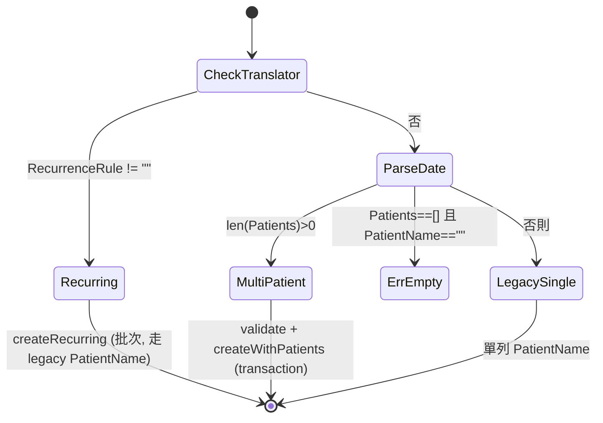

# ScheduleService — 規格（重型 ★）

> 對應檔案：`backend/internal/service/schedule_service.go`
> 上層：[service overview](SERVICE_SPEC.md) ← [ARCHITECTURE_SPEC.md](../../../ARCHITECTURE_SPEC.md)

## 1. 定位與職責
排班的商業邏輯：單筆 / **多病人（SchedulePatient）** 建立、更新（替換整份病人清單）、刪除與**週期群組刪除**、**週期展開（daily/weekly/monthly）**、**批次匯入 V1/V2**、checkin status 推導。
- **不做**：打卡（CheckinService）、診斷狀態（DiagnosisService）。
- `spRepo`/`patientRepo` 為**選用**（`WithPatientRepos` 注入）；未注入時多病人/級聯刪 schedule_patients 不執行（相容舊測試）。

## 2. 對外契約
| 方法 | 重點 |
|------|------|
| `List / ListForTranslator` | 帶 checkinStatus 的排班列表 |
| `Create(req)` | 依 req 走三條路徑：recurrence / multi-patient / legacy 單病人 |
| `Update(id,req)` | partial（指標）；若帶 Patients 則 transaction 內**整批替換** |
| `Delete(id)` | 先刪 checkins + schedule_patients 再刪 schedule |
| `DeleteRecurrenceGroup(id)` | 刪同 group 全部；非群組退化單筆，回刪除筆數 |
| `BatchImportSchedules(rows)` | V1：逐列單病人，壞列不中斷 |
| `BatchImportSchedulesV2(rows)` | V2：依 Code 合併多病人，逐群組驗證 |

> 建立/更新時把 payload 的 `prepaidAmount`（預付，整數元）寫入各 SchedulePatient；`actualAmount` 由 DiagnosisService 後續設定。Response 回兩金額。

Sentinel：`ErrScheduleNotFound / ErrInvalidDateFormat / ErrRecurrenceUntilReq / ErrRecurrenceBeforeStart / ErrInvalidRecurrence / ErrNoDatesGenerated / ErrSchedulePatientsRequired / ErrDuplicatePatientInSchedule / ErrPatientTimeOutOfRange / ErrPatientEndBeforeStart`。

## 3. Create 路徑決策

> ⚠️ **限制**：recurrence 與 multi-patient **不可同時**；週期展開目前只帶 legacy PatientName，不展開多病人。

## 3c. 不變式
| 不變式 | 保證 |
|--------|------|
| 多病人建立 = schedule + schedule_patients 同生同滅 | 機制保證（單一 `db.Transaction`）|
| Update 帶 Patients = 先刪舊 SchedulePatient 再建新（整批替換）| 機制保證（transaction 內 Delete+Create）|
| 同排班不重複病人、病人時段 ⊆ 整體 | 機制保證（validateSchedulePatients；DB 另有 (schedule_id,patient_id) unique）|
| 刪 schedule 前先清子表 | 人工維持（漏呼叫 → FK 錯）|

## 4. 週期展開（expandRecurrenceDates，純函式）
- `daily`：start..until 每天。
- `weekly:1,3,5`：weekday 0-6（0=週日）過濾。
- `monthly:5,20`：逐月走訪，目標日 > 當月天數時 **clamp 到月底**（31→2月=28/29）；去重後排序。
- 錯誤：規則格式錯 → `ErrInvalidRecurrence`；展開 0 筆 → `ErrNoDatesGenerated`；until 早於 start → `ErrRecurrenceBeforeStart`；缺 until → `ErrRecurrenceUntilReq`。

## 5. 邊界條件表
| 情境 | 事件 | 行為 |
|------|------|------|
| translator 不存在 / 非 translator | Create | `ErrTranslatorNotFound` / `ErrNotATranslator` |
| 病人時段超出整體 | Create/Update | `PATIENT_TIME_OUT_OF_RANGE` |
| 病人 end ≤ start | Create/Update | `PATIENT_END_BEFORE_START` |
| 重複病人 | Create/Update | `DUPLICATE_PATIENT_IN_SCHEDULE` |
| patientId 不存在 | Create/Update | `PATIENT_NOT_FOUND` |
| 空 Patients 且無 PatientName | Create | `SCHEDULE_PATIENTS_REQUIRED` |
| monthly 31 號遇短月 | 展開 | clamp 到當月最後一天 |
| V2 同 Code meta 不一致 | Import | 該群組整組失敗（conflicting meta），其他群組仍成功 |
| V2 Code 空 | Import | 該列失敗 |

## 6. checkinStatus 推導（getCheckinStatus）
讀該 schedule 的 checkins：`arrive&&leave→completed` ＞ `任一 makeup→makeup` ＞ `arrive→arrived` ＞ `none`。供前端顯示狀態標記。

## 7. 並發假設
- 多病人建立/替換在 transaction 內安全。
- V1/V2 匯入**逐列/逐群組獨立 commit**（非全有全無）：壞列回報、好列照存。

## 8. 測試考量
- `schedule_service_test.go`、`schedule_service_multipatient_test.go`、`schedule_excel_test.go`。
- 純函式 `expandRecurrenceDates` 易單測（含 clamp、weekday、錯誤規則）。
- 縫：patientRepo 可選擇性注入測「病人存在性」分支。

## 9. 已知技術債
- recurrence 不支援多病人。
- 級聯刪靠 service 手動串 repo。
- 時段字串比較（"HH:MM"）跨午夜不成立。

## 10. 重構方向
- 統一「建立/替換 SchedulePatient」邏輯（Create/Update/Import 目前各自組裝）。
- recurrence + multi-patient 合流：展開日期 × 病人模板。
