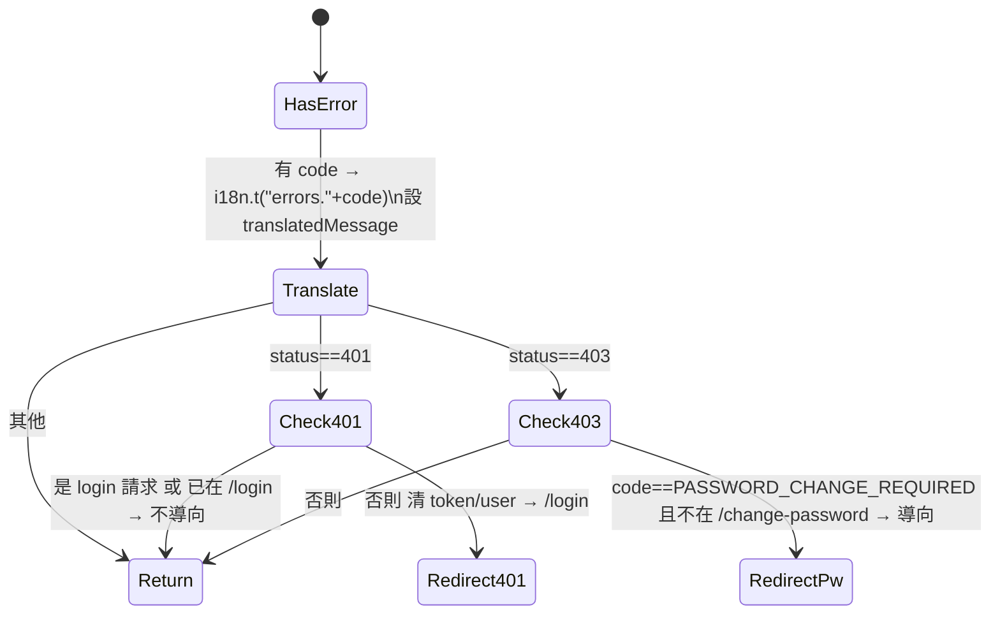

# api — 規格（輕量＋一個關鍵狀態行為）

> 對應檔案：`frontend/src/api/client.ts` + `api/*.ts`
> 上層：[FRONTEND_SPEC](../FRONTEND_SPEC.md)

## 1. 定位與職責
集中所有後端呼叫。`client.ts` 是 axios 實例 + interceptors；`api/<domain>.ts` 是各資源的薄封裝（auth/schedules/checkins/patients/translators/admins/audit/export/diagnosisResults）。
- `checkins.ts` 含診斷照片管理：`uploadDiagnosis` / `listDiagnosisPhotos` / `deleteDiagnosisPhoto`（翻譯員）與 `adminUploadDiagnosis` / `adminListDiagnosisPhotos` / `adminDeleteDiagnosisPhoto`（管理員）；型別 `DiagnosisPhotoItem{id,photoUrl}`。

## 2. client.ts 行為
- `baseURL = '/api'`（相對路徑，避免寫死 localhost 導致外部瀏覽器打不到 — 見 changelog 2026-05-06）。
- **request interceptor**：自 localStorage 取 `token`，加 `Authorization: Bearer`。
- **response interceptor**：
  - `unwrapResponse`：當 body 只有單一 `data` key 時剝掉信封（後端列表端點包 `{data}`）。
  - error → `mapErrorResponse`（見 §3）。

## 3. mapErrorResponse — 錯誤轉譯 + 全域副作用（關鍵）

**為什麼 401 要分流**：登入失敗本身就是 401，若無條件 reload `/login` 會清空表單 + 吞掉 toast，使用者看到空白表單沒回饋。故 login 請求 / 已在 login 頁時**不導向**。

## 4. 不變式
| 不變式 | 保證 |
|--------|------|
| 後端 error code 都對得到 `errors.<CODE>` | 人工維持（漏翻 → 顯示後端英文 fallback）|
| 401（非登入）→ 清憑證導 login | 機制保證（interceptor）|
| 403 PASSWORD_CHANGE_REQUIRED → 導改密碼 | 機制保證 |

## 5. 邊界條件
| 情境 | 行為 |
|------|------|
| 回應只有 `{data}` | 自動 unwrap |
| 回應 `{data, x}` 多 key | 不 unwrap（原樣）|
| 無 code 的錯誤 | 用後端 message |
| login 401 | 不導向，由 Login 頁顯示 toast |

## 6. 測試考量
`api/__tests__/client.test.ts`：`unwrapResponse`、`mapErrorResponse`（注入 mock navigate / currentPath，避免真的改 window.location）皆為可測純(ish)函式 — 兩者**刻意 export** 供測試。

## 7. 協作者
被所有 [pages](../pages/PAGES_SPEC.md) 與 [components](../components/COMPONENTS_SPEC.md) 使用；依賴 [i18n](../i18n/I18N_SPEC.md) 翻譯、[authStore](../stores/AUTH_STORE_SPEC.md) 的 localStorage 約定。
