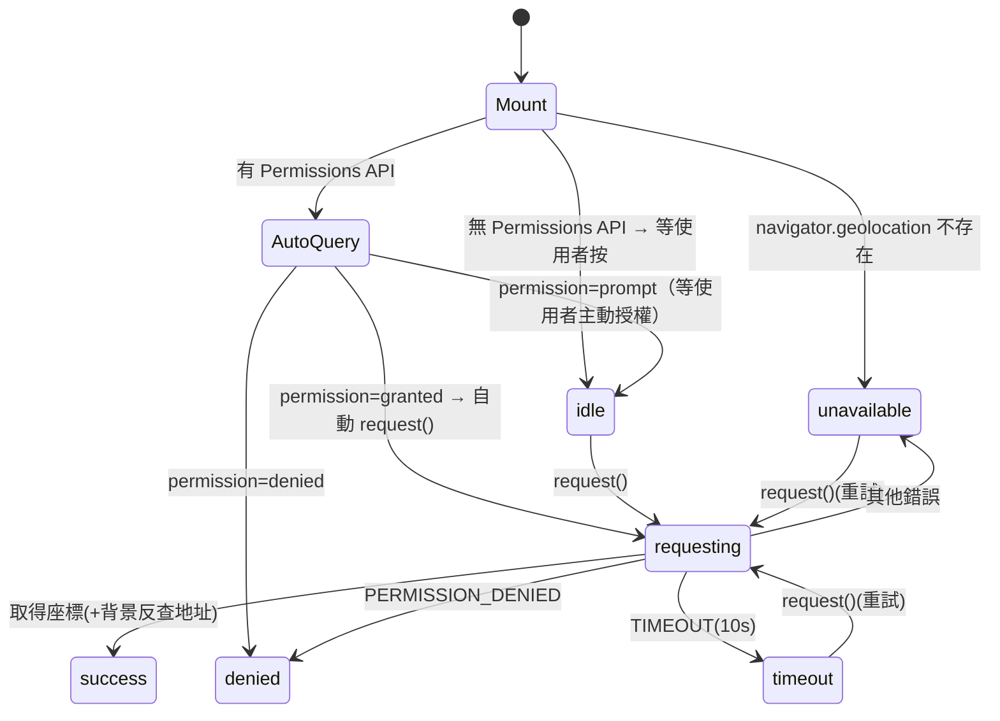

# hooks/useGeolocation — 規格（重型 ★：定位狀態機）

> 對應檔案：`frontend/src/hooks/useGeolocation.ts`
> 上層：[FRONTEND_SPEC](../FRONTEND_SPEC.md)

## 1. 定位與職責
封裝瀏覽器 Geolocation + Permissions API，提供打卡頁所需的定位狀態機與反查地址。設計目標：**permission priming**（不在使用者沒準備好時硬彈系統授權框），並對各種失敗給明確回饋。
- **不做**：送出打卡（由 CheckIn 頁）、阻斷流程（反查地址失敗不影響定位成功）。

## 2. 對外契約
`useGeolocation(): { state, latitude, longitude, address, request }`
- `state: 'idle'|'requesting'|'success'|'denied'|'unavailable'|'timeout'`
- `request()`：手動觸發定位（idle/timeout/unavailable 時由使用者按鈕呼叫）。

## 3. 狀態模型

### 3a. 欄位
- `state`：定位生命週期。
- `latitude/longitude`：成功才有值（否則 null）。
- `address`：先填 `lat,lng` 文字，Nominatim 回來後換成 display_name。

### 3b. 狀態機

### 3c. 不變式
| 不變式 | 保證 |
|--------|------|
| permission=denied 時不再彈系統框 | 機制保證（直接設 denied，不呼叫 getCurrentPosition）|
| 反查地址失敗不改變 success 狀態 | 機制保證（reverseGeocode 回 null 時保留座標文字）|
| 成功才有非 null 座標 | 機制保證 |

## 4. 與 CheckIn 頁的耦合
- CheckIn 的送出按鈕 `disabled={geoState !== 'success'}`：**GPS 成功是打卡前置**（前端強制；後端則允許空座標）。
- `GeoStatusBlock`（在 CheckIn.tsx，可獨立測）依 state 顯示不同 Alert/按鈕（idle→授權鈕、denied→iOS/Android/Chrome 指引、timeout/unavailable→重試）。

## 5. 邊界條件表
| 情境 | state | UI |
|------|-------|----|
| 不支援 geolocation | unavailable | 重試鈕（多半無效）|
| 已授權 | requesting→success | 自動取得 |
| 已拒絕（系統層）| denied | 顯示各平台開啟定位指引 |
| 待決（prompt）| idle | 顯示「請求定位權限」鈕（priming）|
| 逾 10 秒 | timeout | 重試鈕 |
| Permissions API 查詢失敗 | idle | 維持，等手動 |

## 6. 副作用與外部互動
- `navigator.geolocation.getCurrentPosition`（enableHighAccuracy, timeout 10s）。
- `navigator.permissions.query({name:'geolocation'})`（部分瀏覽器不支援 → catch 維持 idle）。
- fetch Nominatim `/reverse`（與後端 [GeocodingService](../../../backend/internal/service/SERVICE_SPEC.md) 同服務；前端失敗則不顯示文字地址）。

## 7. 已知技術債
- 前端 + 後端各反查一次 Nominatim（重複外呼，且 Nominatim 有速率政策）。
- 無 watchPosition；只取單次定位。

## 8. 測試考量
難測點：依賴 `navigator.geolocation` / `permissions` 全域，需在 vitest mock。`GeoStatusBlock` 是純 UI（依 state）較易單測。
